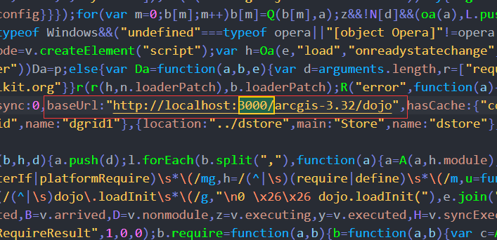

# vue + ArcGIS 地图应用系列一：arcgis api本地部署(开发环境)


##   1.  下载 ArcGIS API for JavaScript

官网地址： [https://developers.arcgis.com/javascript/3/ ]( https://developers.arcgis.com/javascript/3/ )

下载地址：[http://links.esri.com/javascript-api/latest-download](http://links.esri.com/javascript-api/latest-download)

需要稳定的网络环境注册账号后才可以下载，也可以关注微信公众号 RainCode 后台回复 arcgisapi 获取。

下载完成后解压文件，文件比较大可能需要很长时间进行解压。

解压后文件层级很多。

建议大家使用，`arcgis_js_v332_api\arcgis_js_v332_api\arcgis_js_api\library\3.32` 文件夹下`3.32compact` 压缩过的代码（代码是不开源的，直接用压缩的就完事了）。


## 2.  新建静态文件服务器

我自己使用 Express 自己写的一个静态文件服务器（因为要配置跨域，所以习惯了），大家也可以使用 IIS 、Tomcat 等服务器进行搭建。(Express静态文件服务器放在了  https://github.com/LuckRain7/arcgis-api-for-javascript-vue 仓库中的  static-server 文件中，大家可以去 clone 使用。)

将 `3.32compact` 文件夹拷贝到  静态文件夹 `public` 下，修改一个自己喜欢的名字，我这里修改为 `arcgis-3.32`

自建静态文件服务器地址为 `http://localhost:3000/`

## 2.  修改 [HOSTNAME_AND_PATH_TO_JSAPI] 路径

1、找到以下两个文件

`static-server\public\arcgis-3.32\init.js`

`static-server\public\arcgis-3.32\dojo\dojo.js`

2、用编辑器打开，搜索  [HOSTNAME_AND_PATH_TO_JSAPI]  

3、将两个文件中的 `baseUrl ` 内容都改为 `http://localhost:3000/arcgis-3.32/dojo`



## 3. 测试

复制一下代码到 HTML 文件中，将其中 `link` 和 `script` 标签地址修改为定义的地址，打开文件进行测试，出现地图则表示本地部署成功。

```html
<!DOCTYPE html>
<html lang="en">

<head>
    <meta charset="UTF-8">
    <meta name="viewport" content="width=device-width, initial-scale=1.0">
    <title>test arcgis </title>
    <style>
        body,
        html {
            margin: 0;
            padding: 0;
            height: 100%;
            width: 100%;
        }

        #test {
            height: 100%;
            width: 100%;
        }
    </style>
    <link rel="stylesheet" href="http://localhost:3000/arcgis-3.32/esri/css/esri.css">
    <script src="http://localhost:3000/arcgis-3.32/init.js"></script>
</head>

<body>
    <div id="test">

    </div>

    <script>
        require(["esri/map"], function (Map) {
            var map = new Map("test", {
                center: [-118, 34.5],
                zoom: 8,
                basemap: "topo"
            });
        });
    </script>
</body>

</html>
```


您的关注是莫大的鼓励

