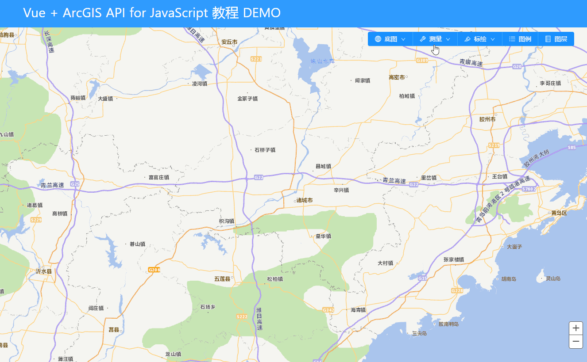
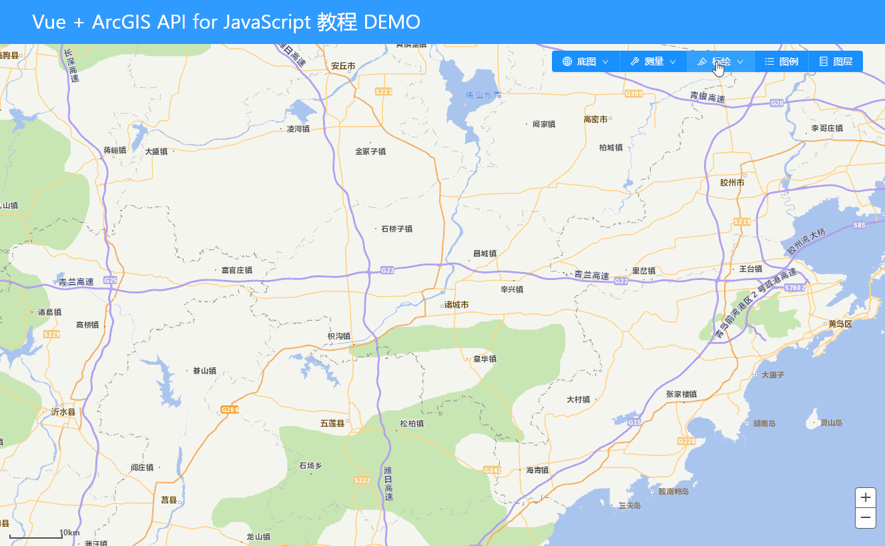

# vue + ArcGIS 地图应用系列三：添加常规的地图组件

> 为了页面的美观，这里我们使用的UI库为： Ant Design Vue 
>
> 项目源码仓库地址：[https://github.com/LuckRain7/arcgis-api-for-javascript-vue ]( https://github.com/LuckRain7/arcgis-api-for-javascript-vue )

## 1. 首先创建工具菜单组件

创建文件 src\components\ToolBar.vue

并通过组件通信写好对应接口

```vue
<template>
  <div class="toolbar">
    <!-- 使用按钮组 -->
    <a-button-group>
      <!-- 地图切换按钮 -->
      <a-dropdown>
        <a-menu slot="overlay">
          <a-menu-item key="1" @click="baseMapChange(1)">
            矢量
          </a-menu-item>
          <a-menu-item key="2" @click="baseMapChange(2)">
            影像
          </a-menu-item>
        </a-menu>
        <a-button type="primary">
          <a-icon type="global" />底图 <a-icon type="down" />
        </a-button>
      </a-dropdown>
      <!-- 地图切换按钮 END-->

      <a-dropdown>
        <a-menu slot="overlay">
          <a-menu-item key="1" @click="measurement(1)">
            开始测量
          </a-menu-item>
          <a-menu-item key="2" @click="measurement(0)">
            取消测量
          </a-menu-item>
        </a-menu>
        <a-button type="primary">
          <a-icon type="tool" />测量 <a-icon type="down" />
        </a-button>
      </a-dropdown>

      <!-- 标绘 GO-->
      <a-dropdown>
        <a-menu slot="overlay">
          <a-menu-item key="1" @click="draw('POINT')">
            点
          </a-menu-item>
          <a-menu-item key="2" @click="draw('POLYLINE')">
            线
          </a-menu-item>
          <a-menu-item key="3" @click="draw('POLYGON')">
            面
          </a-menu-item>
          <a-menu-item key="4" @click="draw('CIRCLE')">
            圆形
          </a-menu-item>
          <a-menu-item key="5" @click="draw('RECTANGLE')">
            长方形
          </a-menu-item>
          <a-menu-item key="6" @click="draw('stop')">
            停止标绘
          </a-menu-item>
          <a-menu-item key="7" @click="draw('delete')">
            清除标绘
          </a-menu-item>
        </a-menu>
        <a-button type="primary">
          <a-icon type="highlight" />标绘 <a-icon type="down" />
        </a-button>
      </a-dropdown>
      <!-- 标绘 END-->

      <a-button type="primary" @click="showLegend">
        <a-icon type="unordered-list" />图例
      </a-button>

      <a-button type="primary" @click="showLayerList">
        <a-icon type="database" />图层
      </a-button>
    </a-button-group>
  </div>
</template>

<script>
export default {
  name: "ToolBar",
  methods: {
    // 开启测量
    measurement(type) {
      this.$emit("measurement", type);
    },
    // 底图切换
    baseMapChange(type) {
      this.$emit("baseMapChange", type);
    },
    // 标绘
    draw(type) {
      this.$emit("draw", type);
    },
    // 显示图例
    showLegend() {
      this.$emit("showLegend");
    },
    // 显示图层
    showLayerList() {
      this.$emit("showLayerList");
    },
  },
};
</script>

<style lang="less">
.toolbar {
  position: absolute;
  top: 80px;
  right: 40px;
  height: 40px;
  width: auto;
  z-index: 99;
}
</style>
```

在 src\App.vue 显示页面引入，并提供组件通讯接口

```vue
<template>
<!-- 工具条组件 -->
<tool-bar
  @measurement="measurement"
  @baseMapChange="baseMapChange"
  @draw="draw"
  @showLegend="showLegend"
  @showLayerList="showLayerList"
></tool-bar>

<!-- 测量组件 -->
<measurement
  :show="isShowMeasurement"
  @closMmeasurement="measurement"
></measurement>
</template>
<script>
import ToolBar from "./components/ToolBar.vue";
components: {
  ToolBar
},
methods: {
  // 测量
  measurement(type) {
    switch (type) {
      case 0:
        this.isShowMeasurement = false;
        Map.MeasurementClose();
        break;
      case 1:
        this.isShowMeasurement = true;
    }
  },
  /* 地图切换 */
  baseMapChange(type) {
    Map.baseMapChange(type);
  },
  // 标绘
  draw(type) {
    Map.drawActive(type);
  },
},
</script>
```

效果图：


## 1.  底图切换

在 example\src\map\init.js 文件中添加底图切换函数

当约定的 Type = 1 时，使用 `addLayer` 方法添加矢量图层并移除影像图层

当约定的 Type = 2 时，使用 `addLayer` 方法添加影像图层并移除矢量图层

ps: `addLayer`方法是对 `map.addLayer() `的二次封装

```javascript
baseMapChange(type) {
  if (type === this.baseMap.type) return; // 防止重复加载

  // 添加 影像
  if (type === 2) {
    this.addLayer(
      [this.baseMap.rasterMap, this.baseMap.rasterMapAnnotation],
      [0, 1]
    );
    this.removeLayer(this.baseMap.vectorMap);
    this.baseMap.type = 2;
  }
  // 添加 矢量
  else {
    this.addLayer(this.baseMap.vectorMap, 0);
    this.removeLayer([
      this.baseMap.rasterMap,
      this.baseMap.rasterMapAnnotation,
    ]);
    this.baseMap.type = 1;
  }
}
```

在 example\src\App.vue 中进行应用

```js
/* 地图切换 */
baseMapChange(type) {
  Map.baseMapChange(type);
},
```

效果图:


## 2.  测量组件

这里需要在 src\map\init.js 中加载 ArcGIS 的测量和单位模块(`"esri/dijit/Measurement"`、` "esri/units"`)

ps: 模块与下方的导出函数一定要一一对应

```diff
#  example\src\map\init.js
loadModules(
  [
    "esri/map",
    "tdlib/SDTDTLayer",
    "tdlib/SDRasterLayer",
    "tdlib/SDRSAnnoLayer",
    "esri/geometry/Extent",
    "esri/SpatialReference",
+    "esri/dijit/Measurement",
+    "esri/units",
    "dojo/parser",
  ],
  config.loadConfig
)
  .then(
    ([
      Map, // 地图模块
      SDTDTLayer, // 山东天地图矢量地图
      SDRasterLayer, // 山东天地图影像地图
      SDRSAnnoLayer, // 山东天地图影像地图注记
      Extent, // 范围模块
      SpatialReference, // 坐标系模块
+      Measurement, //测量模块
+      Units, // 单位模块
      Parser, // 样式解析模块
    ])
```

并进行相关配置 example\src\map\init.js（以下是增量代码，不是文件中实际位置）

```javascript
// 测量工具初始化
this.measurement = new Measurement(
  {
    map: this.map,
    defaultLengthUnit: Units.KILOMETERS,
    defaultAreaUnit: Units.SQUARE_KILOMETERS,
  },
  document.getElementById("measurement")
);
this.measurement.startup();

// 关闭测量工具
MeasurementClose() {
  this.measurement.clearResult(); // 清除地图图案
  // 拿到开启的工具名称 并关闭已开启的工具
  this.measurement.getTool() &&
    this.measurement.setTool(this.measurement.getTool().toolName, false);
}
```

创建一个用来展示测量组件 src\components\Measurement.vue

```vue
<template>
  <div class="measurementdiv" v-show="show">
    <div class="div-header">
      <span class="title">测量组件</span>
      <span class="close" @click="close">X</span>
    </div>
    <div id="measurement"></div>
  </div>
</template>

<script>
export default {
  name: "Measurement",
  props: {
    show: Boolean,
  },
  methods: {
    close() {
      this.$emit("closMmeasurement", 0);
    },
  },
};
</script>
```

在页面中引入 src\App.vue

```vue
<template>
<!-- 测量组件 -->
<measurement
  :show="isShowMeasurement"
  @closMmeasurement="measurement"
></measurement>
</template>
<script>
  methods: {
    // 测量
    measurement(type) {
      switch (type) {
        case 0:
          this.isShowMeasurement = false;
          Map.MeasurementClose();
          break;
        case 1:
          this.isShowMeasurement = true;
      }
    },
  }
</script>
```

效果图：




## 3.  比例尺组件

这里需要在 src\map\init.js 中加载 ArcGIS 的比例尺模块(`"esri/dijit/Scalebar"`)

ps: 模块与下方的导出函数一定要一一对应

```diff
loadModules(
  [
+    "esri/dijit/Scalebar",
  ],
  config.loadConfig
)
  .then(
    ([
+      Scalebar, // 比例尺模块
    ])
```

初始化比例尺

```javascript
Scalebar({
  map: this.map,
  attachTo: "bottom-left",
  scalebarUnit: "metric",
  scalebarStyle: "line",
});
```


## 4. 标绘组件

非常抱歉，写到这里时我重构了代码，大家可以去代码仓库进行查看，重构的目的是为了更加的模块化。

这里需要在 src\map\modules\draw.js 中加载 ArcGIS 的画图模块、点样式模块、线样式模块、填充样式模块、图形模块和图形图层模块(`"esri/toolbars/draw"`、`"esri/symbols/SimpleMarkerSymbol"`、`"esri/symbols/SimpleLineSymbol"`、`"esri/symbols/SimpleFillSymbol"`、`"esri/graphic"`、`"esri/layers/GraphicsLayer"`)

```javascript
/*
 *  Description: 标绘工具
 *  Author: LuckRain7
 *  Date: 2020-05-07 17:05:55
 */
import { loadModules } from "esri-loader";
import config from "../config";

function drawInit() {
  loadModules(
    [
      "esri/toolbars/draw", // 画图
      "esri/symbols/SimpleMarkerSymbol", // 点
      "esri/symbols/SimpleLineSymbol", // 线
      "esri/symbols/SimpleFillSymbol", // 面
      "esri/graphic", // 图形模块
      "esri/layers/GraphicsLayer", // 图形图层模块
    ],
    config.loadConfig
  )
    .then(
      ([
        Draw,
        SimpleMarkerSymbol,
        SimpleLineSymbol,
        SimpleFillSymbol,
        Graphic,
        GraphicsLayer,
      ]) => {
        this.GraphicsLayer = GraphicsLayer;
        this.Graphic = Graphic;
        this.Draw = Draw;
        this.SimpleMarkerSymbol = SimpleMarkerSymbol;
        this.SimpleLineSymbol = SimpleLineSymbol;
        this.SimpleFillSymbol = SimpleFillSymbol;

        // 添加图形图层
        this.DrawGraphics = new GraphicsLayer({ id: "drawLayer" });
        // 设置图层坐标系
        this.DrawGraphics.SpatialReference = new this.SpatialReference({
          wkid: 4490,
        });
        // 将图层加载到地图上，图层设置为 7
        this.map.addLayer(this.DrawGraphics, 7);

        // 实例化画图
        this.draw = new Draw(this.map);

        //定义图形样式
        this.draw.markerSymbol = new SimpleMarkerSymbol();
        this.draw.lineSymbol = new SimpleLineSymbol();
        this.draw.fillSymbol = new SimpleFillSymbol();

        // 添加画图的监听事件
        this.draw.on("draw-complete", drawEndEvent.bind(this));
      }
    )
    .catch((err) => {
      console.error(err);
    });
}

// 内置函数 画完后将图形加载到图形图层
function drawEndEvent(evt) {
  //添加图形到地图
  let symbol;
  if (evt.geometry.type === "point" || evt.geometry.type === "multipoint") {
    symbol = this.draw.markerSymbol;
  } else if (evt.geometry.type === "line" || evt.geometry.type === "polyline") {
    symbol = this.draw.lineSymbol;
  } else {
    symbol = this.draw.fillSymbol;
  }
  // 获取图形样式
  let tx = this.Graphic(evt.geometry, symbol);
  // 将图形样式加载到地图上
  this.DrawGraphics.add(tx);
}

// 设置说话图形
function drawActive(type) {
  let tool = null;
  switch (type) {
    case "POINT":
      tool = "POINT";
      break;
    case "POLYLINE":
      tool = "POLYLINE";
      break;
    case "POLYGON":
      tool = "POLYGON";
      break;
    case "CIRCLE":
      tool = "CIRCLE";
      break;
    case "RECTANGLE":
      tool = "RECTANGLE";
      break;
    case "stop":
      this.draw.deactivate(); // 停止画图
      break;
    case "delete":
      this.draw.deactivate(); // 停止画图
      this.DrawGraphics.clear(); // 清除图层
      break;
  }
  if (tool !== null) {
    this.draw.activate(this.Draw[tool]); //激活对应的绘制工具
  }
}

export { drawInit, drawActive };
```

在 导出文件中引入 src\map\index.js

```javascript
import { MeasurementClose } from "./modules/Measurement.js";

// 导入标绘功能
ArcGIS.prototype.drawInit = drawInit;
ArcGIS.prototype.drawActive = drawActive;
```

在组件中使用即可

效果图：



####  推荐阅读

- [vue + ArcGIS 地图应用系列二：加载地图](https://mp.weixin.qq.com/s/KkTU1Y1GHLmsslTlwxGeIw)

- [vue + ArcGIS 地图应用系列一：arcgis api本地部署(开发环境)](https://mp.weixin.qq.com/s/F2eseCDNGBjoTS52UsY9MA)

#### 关注我！ 不迷路

