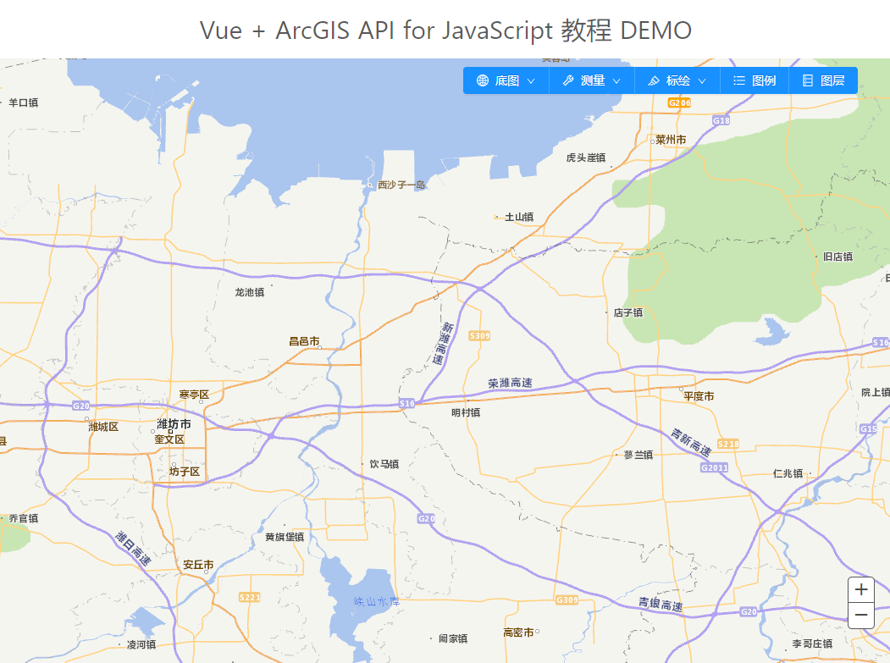
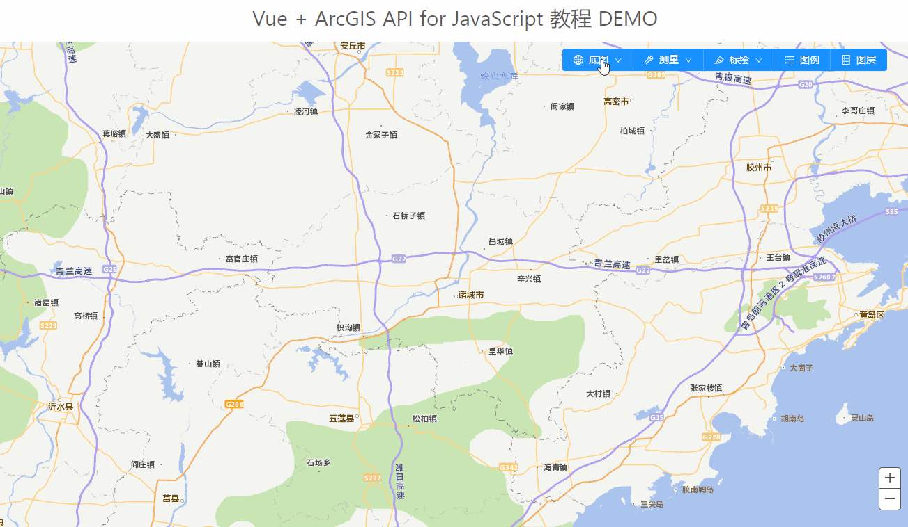

# vue + ArcGIS 地图应用系列三：添加常规的地图组件

> 为了页面的美观，这里我们使用的UI库为： Ant Design Vue 
>
> 项目源码仓库地址：[https://github.com/LuckRain7/arcgis-api-for-javascript-vue ]( https://github.com/LuckRain7/arcgis-api-for-javascript-vue )

## 1. 首先创建工具菜单组件

创建文件 src\components\ToolBar.vue

并通过组件通信写好对应接口

```vue
<template>
  <div id="app">
    <!-- 头部组件 -->
    <my-header />

    <!-- 地图主题组件 -->
    <div class="main">
      <div id="map"></div>
    </div>

    <!-- 工具条组件 -->
    <tool-bar
      @measurement="measurement"
      @baseMapChange="baseMapChange"
      @plot="plot"
      @showLegend="showLegend"
      @showLayerList="showLayerList"
    ></tool-bar>
  </div>
</template>

<script>
import MyHeader from "./components/Header.vue";
import ToolBar from "./components/ToolBar.vue";

// 引入 ArcGIS 模块，并进行实例化
import ArcGIS from "./map/init.js";
let Map = new ArcGIS();
export default {
  name: "App",

  mounted() {
    Map.init("map"); // 初始化地图模块
  },
  methods: {
    measurement() {
      console.log("measurement");
    },
    /* 地图切换 */
    baseMapChange(type) {
      console.log("切换地图底图：", type);
    },
    // 标绘
    plot(type) {
      console.log("标绘", type);
    },
    // 显示图例
    showLegend() {
      console.log("开启图例");
    },
    // 显示图层
    showLayerList() {
      console.log("开启图层");
    },
  },
  components: {
    MyHeader,
    ToolBar,
  },
};
</script>

<style lang="less">
html,
body {
  margin: 0;
  padding: 0;
  width: 100%;
  height: 100%;
}

.main {
  position: absolute;
  top: 70px;
  bottom: 0;
  width: 100%;

  #map {
    width: 100%;
    height: 100%;
  }
}
</style>

```

在 src\App.vue 显示页面引入，并提供组件通讯接口

```vue
<tool-bar
  @measurement="measurement"
  @baseMapChange="baseMapChange"
  @plot="plot"
  @showLegend="showLegend"
  @showLayerList="showLayerList"
></tool-bar>
<script>
import ToolBar from "./components/ToolBar.vue";
components: {
  ToolBar
},
methods: {
  measurement() {
    console.log("measurement");
  },
  /* 地图切换 */
  baseMapChange(type) {
    console.log("切换地图底图：", type);
  },
  // 标绘
  plot(type) {
    console.log("标绘", type);
  },
  // 显示图例
  showLegend() {
    console.log("开启图例");
  },
  // 显示图层
  showLayerList() {
    console.log("开启图层");
  },
},
</script>
```

效果图：




## 1.  底图切换

在 example\src\map\init.js 文件中添加底图切换函数

当约定的 Type = 1 时，使用 `addLayer` 方法添加矢量图层并移除影像图层

当约定的 Type = 2 时，使用 `addLayer` 方法添加影像图层并移除矢量图层

ps: `addLayer`方法是对 `map.addLayer() `的二次封装

```javascript
baseMapChange(type) {
  if (type === this.baseMap.type) return; // 防止重复加载

  // 添加 影像
  if (type === 2) {
    this.addLayer(
      [this.baseMap.rasterMap, this.baseMap.rasterMapAnnotation],
      [0, 1]
    );
    this.removeLayer(this.baseMap.vectorMap);
    this.baseMap.type = 2;
  }
  // 添加 矢量
  else {
    this.addLayer(this.baseMap.vectorMap, 0);
    this.removeLayer([
      this.baseMap.rasterMap,
      this.baseMap.rasterMapAnnotation,
    ]);
    this.baseMap.type = 1;
  }
}
```

在 example\src\App.vue 中进行应用

```js
/* 地图切换 */
baseMapChange(type) {
  Map.baseMapChange(type);
},
```

效果图:




## 2.  测量组件

首先在页面创建一个 div 用来展示测量组件


这里需要在 example\src\map\init.js 中加载 ArcGIS 的测量和单位模块(`"esri/dijit/Measurement"`、` "esri/units"`)

ps: 模块与下方的导出函数一定要一一对应

```diff
#  example\src\map\init.js
loadModules(
  [
    "esri/map",
    "tdlib/SDTDTLayer",
    "tdlib/SDRasterLayer",
    "tdlib/SDRSAnnoLayer",
    "esri/geometry/Extent",
    "esri/SpatialReference",
+    "esri/dijit/Measurement",
+    "esri/units",
    "dojo/parser",
  ],
  config.loadConfig
)
  .then(
    ([
      Map, // 地图模块
      SDTDTLayer, // 山东天地图矢量地图
      SDRasterLayer, // 山东天地图影像地图
      SDRSAnnoLayer, // 山东天地图影像地图注记
      Extent, // 范围模块
      SpatialReference, // 坐标系模块
+      Measurement, //测量模块
+      Units, // 单位模块
      Parser, // 样式解析模块
    ])
```

并进行相关配置

```javascript
#  position: example\src\map\init.js
// 测量工具
let measurement = new Measurement(
  {
    map: this.map,
    defaultLengthUnit: Units.KILOMETERS,
    defaultAreaUnit: Units.SQUARE_KILOMETERS,
  },
  document.getElementById("measureResult")
);
measurement.startup();
```


## 3. 标绘组件


