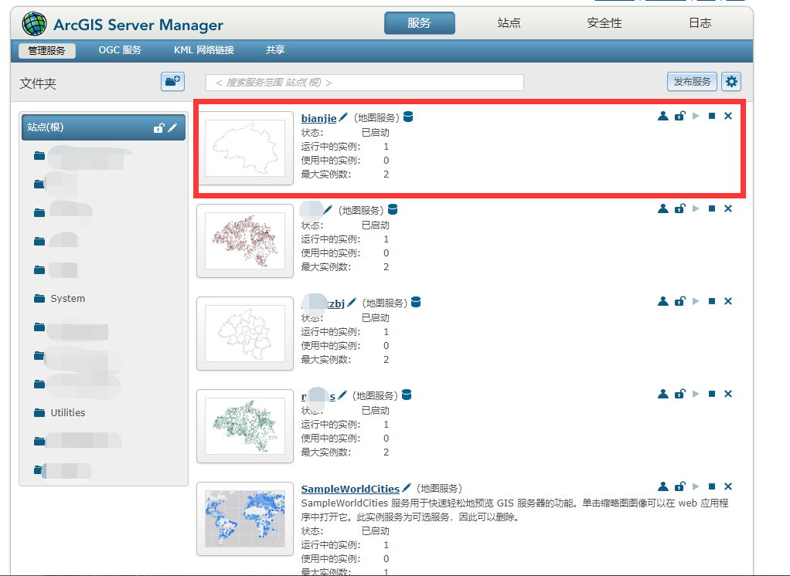
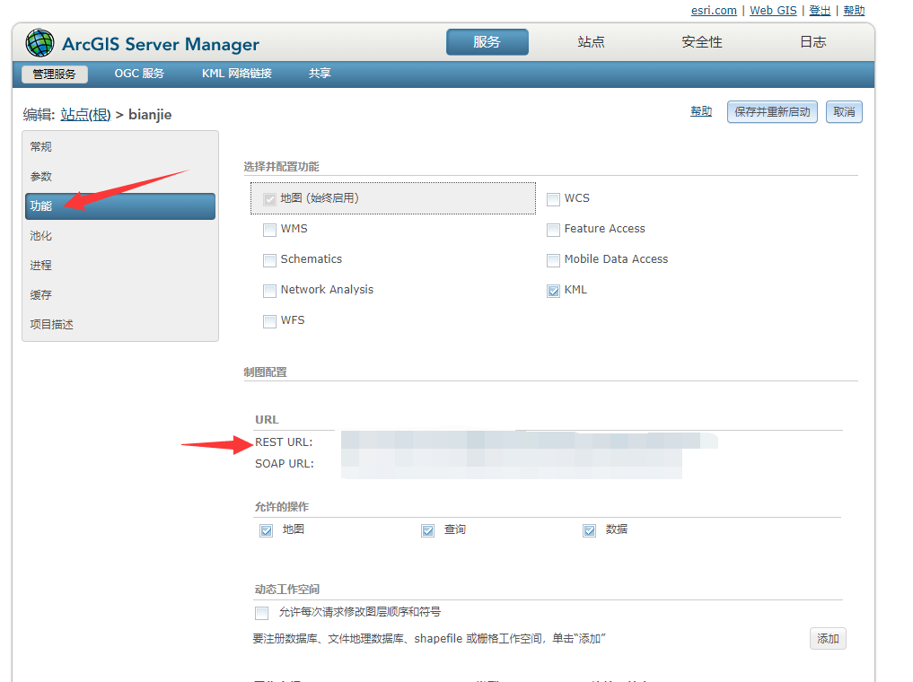

# vue + ArcGIS 地图应用系列四：加载 ArcGIS Server 地图服务

## 1.  ArcGIS Server 服务器

登录自己搭建好的 ArcGIS Server 服务器，找到对应服务的 REST URL 。

 

 


## 2.  在地图中引入

### 2.1  简单引入

在 src\map\init.js 中导入  ArcGISDynamicMapServiceLayer 模块( 允许您使用ArcGIS Server REST API公开的动态地图服务资源。 动态地图服务可即时生成图像。 有关缓存的地图服务 )

```javascript
loadModules(
  [
+    "esri/layers/ArcGISDynamicMapServiceLayer",
  ],
  config.loadConfig
)
  .then(
    ([
+      ArcGISDynamicMapServiceLayer, // ArcGISDynamicMapServiceLayer 模块
    ])
```

在代码中使用

```javascript
// 添加地图边界
// 通过 ArcGISDynamicMapServiceLayer 类进行导入
const bianjieMapServer = new this.ArcGISDynamicMapServiceLayer(
  'https://arcgisserver:6080/arcgis/rest/services/bianjie/MapServer'
);
// 通过 map.addLayer 函数 加载到地图上
this.map.addLayer(bianjieMapServer, 3);
```

### 2.1  复杂服务引入

